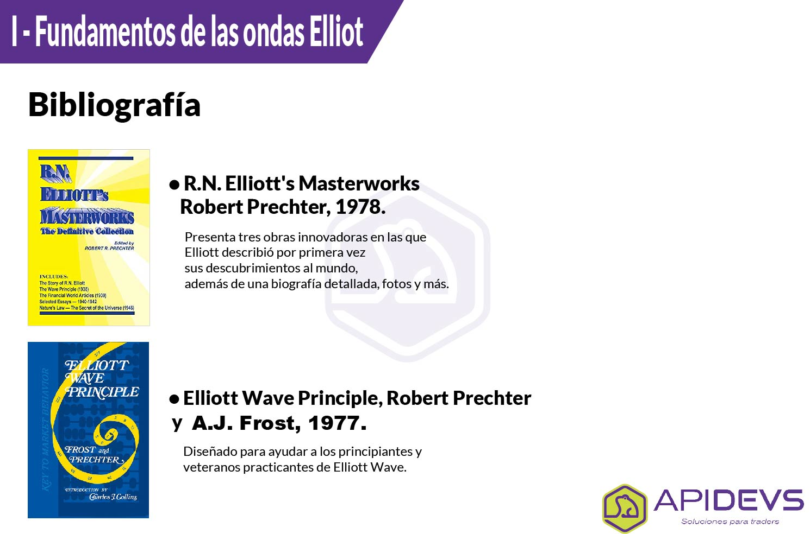
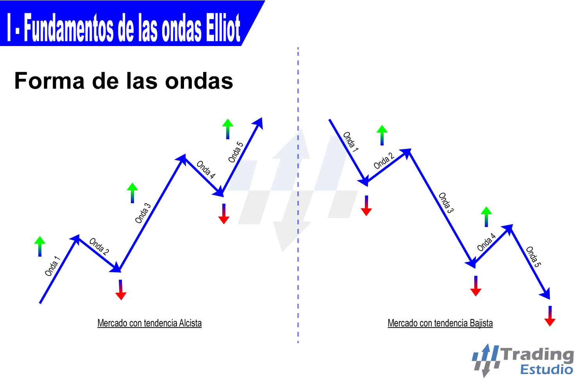

# Módulo I

### La Guía de Elliot

Esta guia fué desarrollada tomando como fuente principal los preceptos universales de <mark style="color:purple;">**Ralph Nelson Elliott**</mark>, dejados en su Monografia **"**<mark style="color:purple;">**The Wave Principle (1938)**</mark>**"**; asi como tambien se usará como referencias los nuevos estudios aportados por <mark style="color:purple;">**Robert Prechter y A.J. Frost**</mark>. Especialistas y estudiosos de las teorias de Elliott.

**Bibliografía**

* <mark style="color:purple;">Ralph Nelson Elliott.</mark>
* <mark style="color:purple;">Elliott Wave Principle.</mark>
* <mark style="color:purple;">R.N. Obras maestras de Elliott.</mark>

### La Teoría de Elliott

“Ralph Nelson Elliott” desarrolló la teoría Elliott Wave en 1930 estudiando varios índices de mercados bursátiles, en especial el [<mark style="color:purple;">Dow Jones</mark>](https://es.wikipedia.org/wiki/%C3%8Dndice\_burs%C3%A1til\_Dow\_Jones) , estudiando un periodo de 75 años, descubrió que los mercados bursátiles no se movían de manera caótica. Los mercados accionarios se movían en ciclos repetitivos , en donde las emociones de los inversionistas eran causa de las influencias externas o sicología de los demás inversionistas en ese momento.

Elliott notó que los movimientos alcistas y bajistas se repetían de manera infinita estos patrones los llamó “<mark style="color:purple;">waves</mark>.” (Ondas). también afirmó que la sicología de los inversores varia de pesimista a optimista y neutral, en estas variaciones es donde el precio va creando patrones (waves); Estas Ondas se traducen en en tendencias, movimientos laterales, inicios y finales de los ciclos del mercado.\
\
Este Comportamiento colectivo humano está atado a la [<mark style="color:purple;">secuencia de Fibonacci</mark>](https://es.wikipedia.org/wiki/Sucesi%C3%B3n\_de\_Fibonacci) o golden ratio.

## La forma de las Ondas

Hay dos modos de desarrollo de ondas: **impulso y corrección**. Las ondas de impulso tienen una estructura de cinco ondas, mientras que las ondas correctivas tienen una estructura de tres ondas o una variación de la misma.\
El modo de motivación se emplea tanto en el patrón de cinco ondas de la como en el sus componentes de la misma dirección, es decir, las ondas 1, 3 y 5. Sus estructuras se denominan "Impulsos" porque empujan poderosamente el mercado. El modo correctivo es empleado por todas las interrupciones de contratendencia, Sus estructuras se denominan "correctivas" porque cada una aparece como una respuesta a la onda motora precedente, pero solo logra un retroceso parcial o "corrección" del progreso que logró. Por lo tanto, los dos modos son fundamentalmente diferentes, tanto en sus roles como en su construcción.

## Los Ciclos de las ondas

Un ciclo completo que consta de ocho ondas, entonces, se compone de dos fases distintas, la fase impulso de cinco ondas (también llamada "cinco", cuyas sub ondas se denotan por números, y la fase correctiva de tres ondas (también llamada " tres "), cuyas sub ondas se denotan con letras. Así como la onda 2 corrige la onda 1, la secuencia A, B, C corrige la secuencia 1, 2, 3, 4, 5. estos ciclos se forman tanto en tendencias alcistas, como en bajistas.

**Construcción compuesta:**

Cuando finaliza un ciclo inicial de ocho ondas como se muestra en el ejemplo 1, se produce un ciclo similar, que luego es seguido por otro movimiento de cinco ondas. Todo este desarrollo produce un patrón de cinco ondas de un grado (es decir, tamaño relativo) más grande que las ondas que lo componen. El resultado se muestra en el ejemplo 3, hasta el pico marcado (5). Este patrón de cinco ondas de mayor grado se corrige luego por un patrón de tres ondas del mismo grado, completando un ciclo completo más grande.

## Diseño esencial

Ahora observe que dentro del patrón correctivo ilustrado como la onda **2** en el ejemplo de la derecha, las ondas (A) y (C), que apuntan hacia abajo, están compuestas por cinco ondas: 1, 2, 3, 4 y 5. De manera similar, la onda (B), que apunta hacia arriba, se compone de tres ondas: A, B y C. Esta construcción revela un punto crucial: las ondas de impulso no siempre apuntan hacia arriba y las ondas correctivas no siempre apuntan hacia abajo. El modo de una onda está determinado no por su dirección absoluta sino principalmente por su dirección relativa.

**Impulsos y correcciones:**

Las ondas de **impulso** poseen cinco ondas cuando se tiende en la misma dirección como la onda de un grado mayor del que forma parte, y en modo correctivo poseen (tres ondas o una variación) cuando se tiende en la dirección opuesta. Las ondas (A) y (C) son de impulso, con tendencia en la misma dirección que la onda 2. La onda (B) es **correctiva** porque corrige la onda (A) y es una tendencia contraria a la onda 2. En resumen, la tendencia subyacente esencial del Principio de onda es que la acción en la misma dirección que la tendencia más grande se desarrolla en cinco ondas, mientras que la reacción contra la tendencia más grande se desarrolla en tres ondas, en todos los grados de tendencia.

## Conteo de las Ondas

  

Las ondas de cualquier tipo y en cualquier serie, pueden subdividirse y volver a subdividirse en ondas de grado inferior, o a la inversa, expandirse en ondas de grado superior.

#### En la figura indicada vemos tres grados de onda: 

* Ondas ((1)) – ((2))
* Ondas (1) – (2) – (3) – (4) – (5) – (a) – (b) – (c)
* Ondas 1 – 2 – 3 – 4 – 5 – a – b – c

El conteo y etiquetado de las Ondas permite al inversor proyectar posibles escenarios a través del análisis de las Ondas de Elliot; para la ejecución correcta de este método se recomienda unificar el empleo de colores siguiendo las <mark style="color:purple;">pautas estandarizadas</mark> de Elliot Wave.

##

